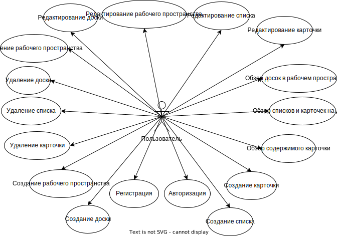
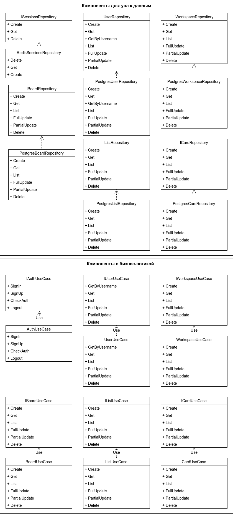

# Trello analog

## 1. Цель работы, решаемая проблема/предоставляемая возможность

Данное приложение - аналог популярного приложения Trello. Предоставляет возможность для управления задачами, которое
помогает пользователю организовать свою работу. Приложение также позволяет удобно структурировать информацию и работать
с ней.

## 2. Краткий перечень функциональных требований

- Регистрация, авторизация
- CRUD операции для рабочих пространств, досок, списков и карточек.
- CRUD операции для профиля пользователя.
- Поиск 

## 3. Use-case диаграмма системы

## 4. BPMN диаграмма основных бизнес-процессов

### Диаграмма бизнес-правил

### Отдельные, более подробно рассмотренные бизнес-правила

## 5. Примеры описания основных пользовательских сценариев

1. Если пользователь начинает использование приложения впервые, то ему
   необходимо зарегистрироваться в системе. Для этого он вводит логин, пароль,
   email и свое имя. При нажатии на кнопку зарегистрироваться в системе будет
   создан новый пользователь. После регистрации пользователь должен попасть в
   окно просмотра рабочих пространств.
2. Если пользователь уже зарегистрировался, то при новом запуске приложения он
   должен авторизоваться - ввести логин и пароль либо если с момента последнего
   использования прошло меньше месяца, то приложение будет помнить о его прошлом
   входе и не запросит данные авторизации. После этого этапа пользователь
   попадает на то окно, на котором он остановился в прошлый раз.
3. Находясь в окне отображения рабочих пространств, пользователь может создавать
   новые рабочие пространства, удалять их и менять их название. Также он может
   выбрать нужное текущее пространство, после чего он попадет в окно обзора
   этого рабочего пространства.
4. Находясь в окне отображения досок выбранного рабочего пространства,
   пользователь может создавать новые доски, удалять их и менять их название.
   Также он может выбрать нужную доску, после чего он попадет в
   окно обзора этой доски.
5. Находясь в окне отображения доски, пользователь может создавать новые списки
   и карточки, удалять их и менять их. Также он может выбрать нужную
   карточку, после чего он попадет в окно редактирования данной карточки.
6. Находясь в окне редактирования карточки, пользователь может изменить ее
   содержимое и название.
7. Пользователь может посмотреть данные своего профиля, отредактировать их.
8. Находясь в окне отображения доски пользователь может выполнить поиск, чтобы 
   найти необходимую карточку или список.

## 6. ER-диаграмма сущностей

## 7. Диаграмма БД

## 8. Компонентная диаграмма системы

### Верхнеуровневое разбиение на компоненты.

### UML-диаграмма классов.

## 9. Экраны будущего web-приложения на уровне черновых эскизов.

### Экран одной доски

### Форма редактирования карточки

### Форма настроек пользователя

### Обзор рабочих пространств

